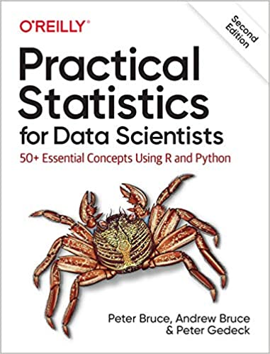

# Practical-Statistics-for-Data-Science
These are my personal notes for the book Practical Statistics for Data Science.

# Code repository
<table width='100%'>
 <tr>
  <td></td>
  <td>
   
<b>Practical Statistics for Data Scientists:</b>

   
50+ Essential Concepts Using R and Python 
by Peter Bruce, Andrew Bruce, and <a href="https://www.amazon.com/Peter-Gedeck/e/B082BJZJKX/?&_encoding=UTF8&tag=petergedeck-20&linkCode=ur2&linkId=089cd2d466348aa1e598aab0a42aa207&camp=1789&creative=9325">Peter Gedeck</a>

   <ul>
    <li>Publisher: <a href="https://oreil.ly/practicalStats_dataSci_2e">O'Reilly Media</a>; 2nd edition (June 9, 2020)</li>
   <li>ISBN-13: 978-1492072942</li>
   <li>Errata: <a href="http://oreilly.com/catalog/errata.csp?isbn=9781492072942">http://oreilly.com/catalog/errata.csp?isbn=9781492072942</a></li>
   </ul>
    </td>
  </tr>
</table>
